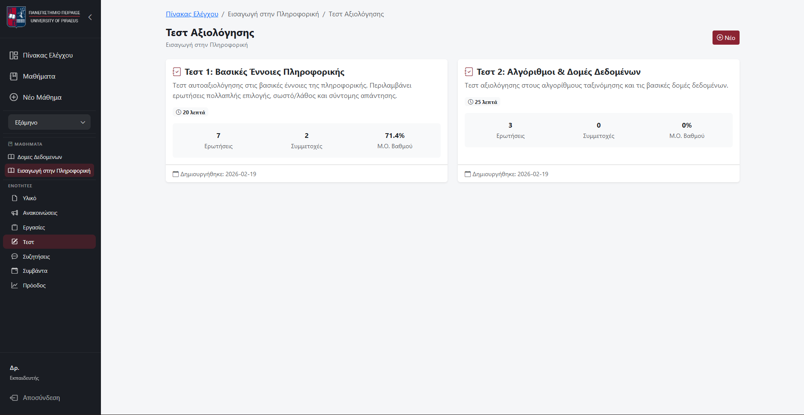
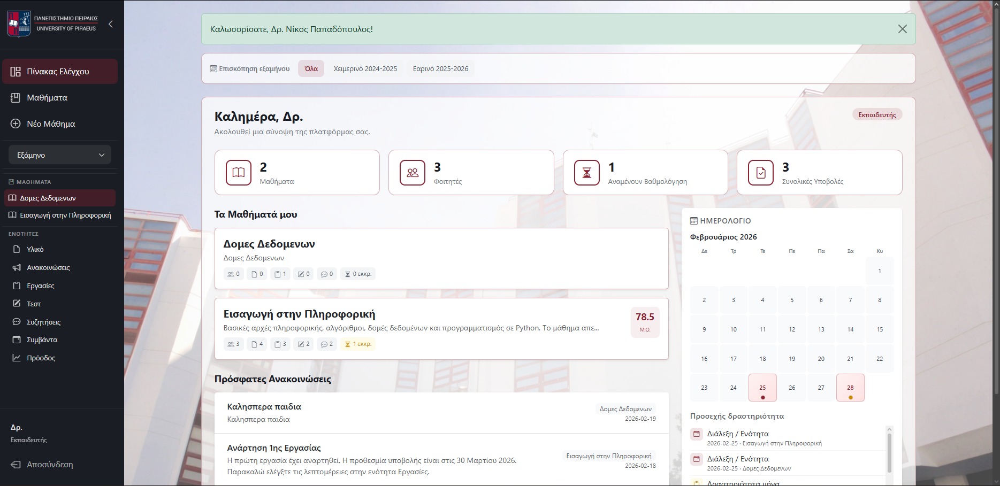
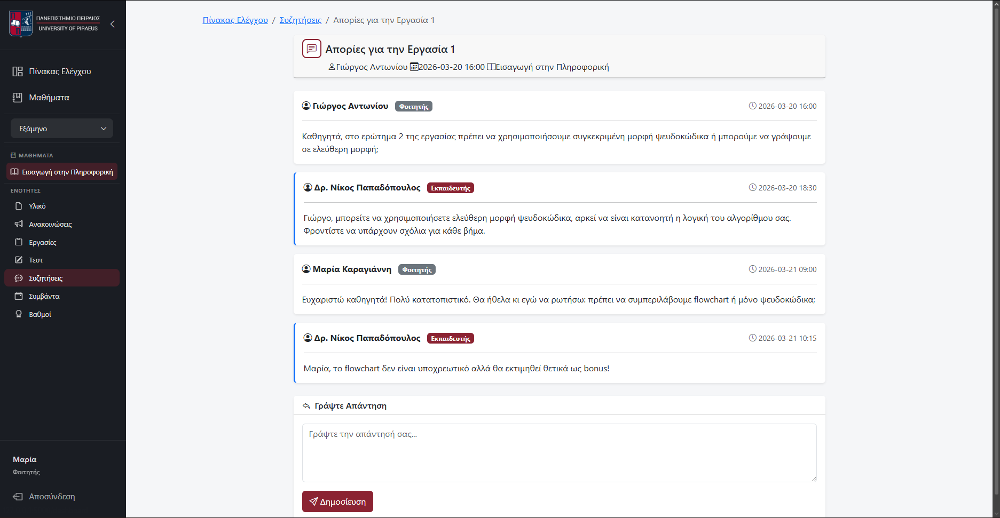
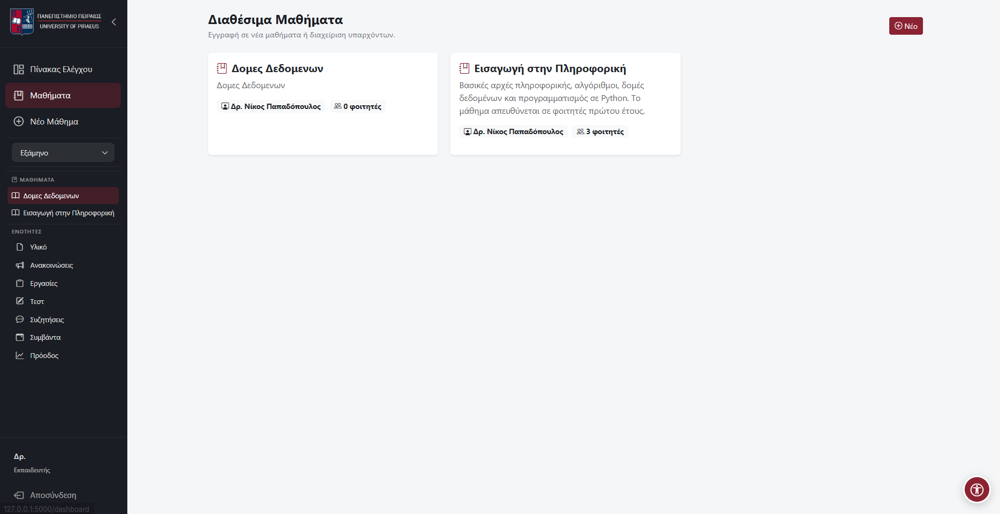
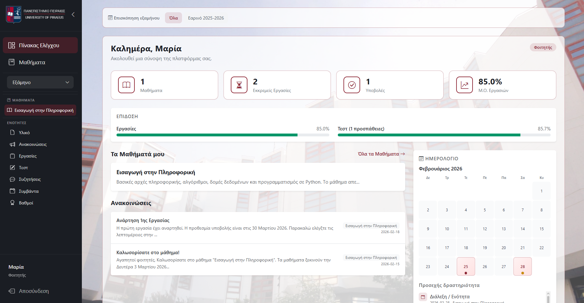

<p align="center">
  
</p>

<h1 align="center">EduLearn LMS</h1>
<h3 align="center">Σύστημα Διαχείρισης Μάθησης — Learning Management System</h3>

<p align="center">
  <strong>Πανεπιστήμιο Πειραιώς</strong> · Τμήμα Πληροφορικής<br>
  Μάθημα: <em>Λογισμικό Διαχείρισης Μάθησης</em><br>
  Ακαδημαϊκό Έτος 2025–2026
</p>

<p align="center">
  <strong>Χρήστος Πολυπαθέλης (π24251)</strong>
</p>

<p align="center">
  <code>Python</code> · <code>Flask</code> · <code>SQLite</code> · <code>Bootstrap 5</code> · <code>JavaScript</code>
</p>

---

## 🚀 LIVE DEPLOYMENT

<div align="center" style="background-color: #FFD700; padding: 20px; border-radius: 10px; margin: 20px 0;">

### 📱 **Δείτε την εφαρμογή LIVE εδώ:**

# [🔗 https://edu-learn-lms.vercel.app](https://edu-learn-lms.vercel.app)

**Έτοιμο για Demo!** — Σχεδιασμένο και αναπτυγμένο για production με Vercel deployment.

</div>

---

## Περιγραφή

Ολοκληρωμένη, production-grade web εφαρμογή **Συστήματος Διαχείρισης Μάθησης (LMS)**, σχεδιασμένη και υλοποιημένη εξ αρχής στα πλαίσια της εργασίας 8 μονάδων (**Θέμα 2 — Ανάπτυξη Ηλεκτρονικού Συστήματος Διαχείρισης Μάθησης**).

Η εφαρμογή εξυπηρετεί δύο διακριτούς ρόλους χρηστών — **Εκπαιδευτή** και **Εκπαιδευόμενο** — με πλήρη διαχωρισμό δικαιωμάτων, εξειδικευμένο dashboard ανά ρόλο, και ολοκληρωμένο σύνολο λειτουργιών που καλύπτει **κάθε ζητούμενο** της εκφώνησης, ενώ ταυτόχρονα υπερβαίνει σημαντικά τις ελάχιστες απαιτήσεις με 18+ επιπρόσθετα χαρακτηριστικά enterprise-level, συμπεριλαμβανομένου ολοκληρωμένου συστήματος προσβασιμότητας (WCAG).

**Βασικά σημεία:**
- Περίπου **2.000 γραμμές** backend κώδικα (Python/Flask) με πλήρη σχολιασμό στα ελληνικά
- **25+ HTML templates** με σύστημα κληρονομικότητας (Jinja2)
- Σχεσιακή βάση δεδομένων με **14 πίνακες** και foreign keys
- Περίπου **1.000 γραμμές** custom CSS και **130 γραμμές** JavaScript
- Πλήρης ασφάλεια: hashed passwords, session protection, security headers, parameterized SQL
- Custom branding Πανεπιστημίου Πειραιώς με responsive sidebar navigation

---

## Στιγμιότυπα Εφαρμογής

| Πίνακας Ελέγχου Εκπαιδευτή | Πλοήγηση & Μαθήματα |
|:---:|:---:|
|  |  |

| Λειτουργίες Μαθήματος | Τεστ & Αξιολόγηση |
|:---:|:---:|
|  |  |

| Ημερολόγιο & Συμβάντα |
|:---:|
|  |

---

## Εκκίνηση

```bash
# 1. Κλωνοποίηση αποθετηρίου
git clone <repo-url>
cd ΛΟΓΙΣΜΙΚΟ_ΔΙΑΧΕΙΡΙΣΗΣ_ΜΑΘΗΣΗΣ

# 2. Εγκατάσταση εξαρτήσεων
pip install -r requirements.txt

# 3. Εκτέλεση εφαρμογής
python app.py

# 4. Πρόσβαση μέσω browser
#    http://127.0.0.1:5000
```

Η βάση δεδομένων (`lms.db`) δημιουργείται αυτόματα κατά την πρώτη εκκίνηση, με πλήρη demo δεδομένα: χρήστες, μαθήματα, υλικό, εργασίες, υποβολές, τεστ, απαντήσεις, ανακοινώσεις, συζητήσεις και συμβάντα ημερολογίου.

---

## Deploy στο Vercel

Η εφαρμογή είναι έτοιμη για deployment στο [Vercel](https://vercel.com) ως Python serverless function.

### Βήματα

```bash
# 1. Εγκατάσταση Vercel CLI (αν δεν υπάρχει)
npm i -g vercel

# 2. Deploy
vercel

# 3. Production deploy
vercel --prod
```

Εναλλακτικά, συνδέστε το GitHub repository στο [vercel.com/dashboard](https://vercel.com/dashboard) για αυτόματο deploy σε κάθε push.

### Τι γίνεται αυτόματα

- Η βάση δεδομένων (SQLite) δημιουργείται στο `/tmp` με demo δεδομένα σε κάθε cold start
- Η αρχικοποίηση τρέχει σε module-level — λειτουργεί χωρίς `__main__`
- Static files (CSS, JS, εικόνες) σερβίρονται κανονικά μέσω Flask
- Uploads αποθηκεύονται στο `/tmp/uploads` (δεν παραμένουν μεταξύ cold starts — αναμενόμενο για serverless)

### Environment Variables (προαιρετικά)

Στο Vercel Dashboard → Settings → Environment Variables, μπορείτε να ορίσετε:

| Μεταβλητή | Περιγραφή |
|---|---|
| `SECRET_KEY` | Κλειδί κρυπτογράφησης session (συνιστάται για production) |

> **Σημείωση:** Η μεταβλητή `VERCEL` ορίζεται αυτόματα από το Vercel — η εφαρμογή την αναγνωρίζει και χρησιμοποιεί `/tmp` αντί για το read-only filesystem.

---

## Λογαριασμοί

| Ρόλος | Username | Password |
|:---:|:---:|:---:|
| Εκπαιδευτής | `teacher` | `teacher123` |
| Φοιτήτρια | `maria` | `student123` |
| Φοιτητής | `giorgos` | `student123` |
| Φοιτήτρια | `eleni` | `student123` |

Προφορτωμένα 2 πλήρη μαθήματα: *Εισαγωγή στην Πληροφορική* (Εαρινό 2025-2026), *Δομές Δεδομένων* (Χειμερινό 2024-2025) — καθένα με υλικό, ανακοινώσεις, εργασίες, τεστ, συζητήσεις, βαθμολογίες και συμβάντα.

---

## Πλήρης Κάλυψη Απαιτήσεων Εκφώνησης (Θέμα 2)

Κάθε ζητούμενο της εργασίας καλύπτεται πλήρως. Ακολουθεί αναλυτική αντιστοίχιση:

### Ρόλοι Χρηστών

| Απαίτηση Εκφώνησης | Υλοποίηση | Κώδικας |
|---|---|---|
| 2 ρόλοι-χρήστες (τουλάχιστον): εκπαιδευτής και εκπαιδευόμενος | Πεδίο `role` στον πίνακα `users` με `CHECK(role IN ('instructor', 'student'))`. Πρόσβαση ελέγχεται μέσω custom decorators `@login_required` και `@instructor_required`. | `app.py`, γρ. 78–98 |

### Δυνατότητες Εκπαιδευτή

| Απαίτηση Εκφώνησης | Υλοποίηση | Route / Template |
|---|---|---|
| **Ανάρτηση υλικού** | Upload αρχείων (PDF, DOCX, PPTX, εικόνες, βίντεο, ZIP), εξωτερικά links, βίντεο. Τρεις τύποι υλικού (`document`, `presentation`, `video`). Ασφαλές upload με `secure_filename` και timestamp. | `/course/<id>/materials/upload` — `upload_material.html` |
| **Δημιουργία γραπτών δοκιμασιών** | Τεστ αξιολόγησης με **3 διαφορετικούς τύπους ερωτήσεων**: πολλαπλής επιλογής, σωστό/λάθος, σύντομης απάντησης. Δυναμική JavaScript φόρμα. Παραμετροποιήσιμο χρονικό όριο και μονάδες ανά ερώτηση. | `/course/<id>/tests/create` — `create_test.html` |
| **Ανάρτηση ανακοινώσεων** | Δημιουργία ανακοινώσεων ανά μάθημα. Αυτόματη εμφάνιση στο dashboard και στη σελίδα ανακοινώσεων. | `/course/<id>/announcements/create` — `create_announcement.html` |
| **Ανέβασμα εργασιών** | Δημιουργία εργασιών με τίτλο, περιγραφή, προθεσμία υποβολής, μέγιστο βαθμό. Βαθμολόγηση κάθε υποβολής με γραπτό feedback. | `/course/<id>/assignments/create`, `/submission/<id>/grade` |
| **Παρακολούθηση προόδου εκπαιδευομένων** | Αναλυτικός πίνακας ανά φοιτητή: υποβληθείσες εργασίες, μέσος όρος βαθμολογίας, ολοκληρωμένα τεστ, μέσος όρος τεστ, αριθμός συμμετοχών σε forum. | `/course/<id>/progress` — `progress.html` |

### Δυνατότητες Εκπαιδευόμενου

| Απαίτηση Εκφώνησης | Υλοποίηση | Route / Template |
|---|---|---|
| **Πρόσβαση στο εκπαιδευτικό υλικό** | Προβολή και λήψη υλικού (αρχεία, links, βίντεο). Κατηγοριοποίηση ανά τύπο. | `/course/<id>/materials` — `materials.html` |
| **Απάντηση στις γραπτές δοκιμασίες** | Εκτέλεση τεστ με αυτόματη βαθμολόγηση. Αναλυτική παρουσίαση αποτελεσμάτων ανά ερώτηση (σωστές/λάθος απαντήσεις, σωστή απάντηση). | `/test/<id>/take`, `/test/result/<id>` |
| **Αποκλειστική πρόσβαση στη βαθμολογία** | Κάθε φοιτητής βλέπει αποκλειστικά τους δικούς του βαθμούς εργασιών και τεστ. Ο έλεγχος γίνεται μέσω `session['user_id']`. | `/course/<id>/grades` — `grades.html` |
| **Ενημέρωση για συμβάντα μαθήματος** | Ημερολόγιο μαθημάτων στο dashboard. Τύποι συμβάντων: `lecture`, `deadline`, `exam`, `general`. Αναλυτική σελίδα ανά μάθημα. | `/course/<id>/events` — `events.html`, Dashboard Calendar |
| **Συμμετοχή σε συζητήσεις** | Δημιουργία νέων θεμάτων και απαντήσεις σε νήματα. Εκπαιδευτής και εκπαιδευόμενοι συμμετέχουν ισότιμα. | `/course/<id>/discussions`, `/discussion/<id>` |

### Εγγεγραμμένοι Εκπαιδευόμενοι και Αλληλεπίδραση

| Απαίτηση Εκφώνησης | Υλοποίηση |
|---|---|
| Τουλάχιστον 2–3 εγγεγραμμένοι εκπαιδευόμενοι | **3 φοιτητές**: Μαρία Καραγιάννη, Γιώργος Αντωνίου, Ελένη Μιχαλοπούλου |
| Διεκπεραίωση εργασιών | 3 υποβολές εργασιών — 2 βαθμολογημένες με γραπτό feedback, 1 σε εκκρεμότητα |
| Απάντηση σε Forum / Απορίες | 2 συζητήσεις με πολλαπλά μηνύματα: ερωτήσεις φοιτητών, απαντήσεις καθηγητή |
| Συμμετοχή σε τεστ | 2 ολοκληρωμένες απόπειρες τεστ (Μαρία: 12/14, Γιώργος: 8/14) με πλήρεις απαντήσεις |
| Αποστολή βαθμολογίας | Βαθμολογημένες εργασίες: 85/100 και 72/100, με σχόλια εκπαιδευτή |

### Τεχνολογίες

| Ζητούμενο | Υλοποίηση |
|---|---|
| HTML | 25+ Jinja2 templates με σύστημα κληρονομικότητας |
| CSS | Bootstrap 5.3.2 και ~1000 γραμμές custom CSS |
| JavaScript | Vanilla JavaScript — AJAX navigation, δυναμικές φόρμες, sidebar |
| Bootstrap | Bootstrap 5.3.2, Bootstrap Icons 1.11.1 |
| Γλώσσα προγραμματισμού | Python 3, Flask framework, Werkzeug |
| Βάση Δεδομένων | SQLite — 14 σχεσιακοί πίνακες με foreign keys |

---

## Επιπρόσθετα Χαρακτηριστικά (Πέρα από τα Ζητούμενα)

Πέρα από την πλήρη κάλυψη των απαιτήσεων, υλοποιήθηκαν τα ακόλουθα ως επιπλέον εξάσκηση και εφαρμογή βέλτιστων πρακτικών:

| # | Χαρακτηριστικό | Περιγραφή |
|---|---|---|
| 1 | **Σύστημα εγγραφής χρηστών** | Πλήρης φόρμα εγγραφής με validation: ελάχιστο μήκος κωδικού, αντιστοίχιση passwords, μοναδικό username |
| 2 | **Custom Theme Πανεπιστημίου Πειραιώς** | Ενιαία οπτική ταυτότητα με τα χρώματα του Πανεπιστημίου (`#8B2332`), επίσημο logo, favicon, apple-touch-icon |
| 3 | **Responsive Collapsible Sidebar** | Πλαϊνή μπάρα πλοήγησης με δυνατότητα σύμπτυξης/επέκτασης, αποθήκευση κατάστασης (localStorage), responsive σε κινητές συσκευές |
| 4 | **Dashboard Calendar** | Δυναμικό ημερολόγιο μηνός στο dashboard — εμφάνιση κουκκίδων σε ημέρες με events ή deadlines |
| 5 | **AJAX Φίλτρο Εξαμήνου** | Φιλτράρισμα μαθημάτων κατά εξάμηνο (Εαρινό/Χειμερινό) χωρίς ανανέωση σελίδας |
| 6 | **Security Headers** | X-Content-Type-Options, X-Frame-Options, X-XSS-Protection, Referrer-Policy σε κάθε response |
| 7 | **Session Security** | HttpOnly cookies, SameSite=Lax, Secure cookies σε production, 24-ωρη λήξη |
| 8 | **Custom Error Pages** | Σελίδες σφάλματος 403, 404, 500 — HTML για browser, JSON για AJAX requests |
| 9 | **SEO Optimization** | Meta descriptions, Open Graph tags, canonical URLs, theme-color, noindex σε error pages |
| 10 | **Environment Configuration** | python-dotenv για SECRET_KEY, DB_PATH, PORT — τα secrets δεν γίνονται commit |
| 11 | **Πολλαπλά Μαθήματα & Εξάμηνα** | Υποστήριξη πολλαπλών μαθημάτων, εγγραφή φοιτητών, φιλτράρισμα ανά εξάμηνο |
| 12 | **JSON API** | REST-style endpoint για events (`/api/events/<id>`) |
| 13 | **Ασφαλές File Upload** | Validation τύπου αρχείου, 16MB limit, secure filenames, timestamp prefix |
| 14 | **Aggregated Dashboard Statistics** | Summary cards με συνολικούς φοιτητές, υλικό, εκκρεμείς υποβολές, μέσο όρο βαθμολογιών |
| 15 | **Assignment Grading & Feedback** | Πλήρης αξιολόγηση υποβολών εργασιών με βαθμό και γραπτά σχόλια |
| 16 | **Auto-Grading Tests** | Αυτόματη βαθμολόγηση τεστ αμέσως μετά την υποβολή |
| 17 | **Static Asset Caching** | Cache-Control headers για στατικά αρχεία — βελτίωση ταχύτητας φόρτωσης |
| 18 | **Accessibility Toolkit (WCAG)** | Πλήρες σύστημα προσβασιμότητας — αναλυτικά παρακάτω |

---

## Προσβασιμότητα (Accessibility)

Η εφαρμογή ενσωματώνει ολοκληρωμένο σύστημα προσβασιμότητας, αντίστοιχο με αυτά σύγχρονων εκπαιδευτικών πλατφορμών (Canvas, Moodle, Blackboard), ακολουθώντας τις οδηγίες WCAG 2.1:

### Εργαλεία Προσβασιμότητας (Floating Toolbar)

Floating accessibility toolbar (κάτω δεξιά) με τις εξής δυνατότητες:

| Λειτουργία | Περιγραφή |
|---|---|
| **Μέγεθος Κειμένου** | Αύξηση/μείωση μεγέθους γραμματοσειράς (6 επίπεδα: 75%–150%) |
| **Υψηλή Αντίθεση** | High-contrast mode — μαύρο φόντο, λευκό κείμενο, χρυσά links |
| **Γραμματοσειρά Δυσλεξίας** | Εναλλαγή σε OpenDyslexic font με αυξημένο line-height και letter-spacing |
| **Αποχρώσεις Γκρι** | Grayscale filter σε ολόκληρη τη σελίδα |
| **Υπογράμμιση Συνδέσμων** | Εμφάνιση underline σε κάθε σύνδεσμο για ευκολότερη αναγνώριση |
| **Μεγάλος Δείκτης** | Μεγεθυμένος cursor (SVG-based) για άτομα με κινητικά προβλήματα |
| **Οδηγός Ανάγνωσης** | Οριζόντια ζώνη που ακολουθεί τον κέρσορα — βοηθά στη γραμμή ανάγνωσης |
| **Μείωση Κίνησης** | Απενεργοποίηση animations/transitions (σέβεται και `prefers-reduced-motion`) |
| **Επαναφορά Όλων** | Μονό κουμπί επαναφοράς σε εργοστασιακές ρυθμίσεις |

Όλες οι ρυθμίσεις αποθηκεύονται σε `localStorage` και εφαρμόζονται αυτόματα σε κάθε επίσκεψη.

### Δομικά Χαρακτηριστικά Προσβασιμότητας

| Χαρακτηριστικό | Υλοποίηση |
|---|---|
| **Skip-to-Content Link** | Εμφανίζεται στο Tab — παράκαμψη πλοήγησης, μετάβαση στο περιεχόμενο |
| **ARIA Landmarks** | `role="navigation"`, `role="main"`, `role="region"`, `role="contentinfo"`, `role="dialog"` |
| **ARIA Labels** | Ελληνικά `aria-label` σε sidebar, navigation, main content, toolbar, panel |
| **ARIA Live Regions** | `aria-live="polite"` στο content area — ανακοίνωση αλλαγών σε screen readers |
| **Focus Trap** | Keyboard focus παραμένει εντός accessibility panel όταν είναι ανοιχτό |
| **Escape to Close** | Κλείσιμο panel με πλήκτρο Escape |
| **Focus-Visible Styles** | Ορατό focus outline (3px solid) σε κάθε διαδραστικό στοιχείο κατά πλοήγηση με Tab |
| **Form Autocomplete** | Σωστά `autocomplete` attributes σε login/register forms |
| **aria-describedby** | Βοηθητικό κείμενο κωδικού προσβάσιμο σε screen readers |
| **aria-pressed** | Σωστή κατάσταση toggle buttons στο accessibility panel |
| **aria-expanded** | Δυναμική ενημέρωση σε dropdown/collapsible στοιχεία |
| **Screen Reader Text** | `.sr-only` utility class για κείμενο αποκλειστικά για screen readers |
| **prefers-reduced-motion** | Αυτόματη αναγνώριση OS-level ρύθμισης μείωσης κίνησης |
| **Responsive A11y** | Toolbar προσαρμοσμένο σε mobile viewports |

---

## Αρχιτεκτονική

### Τεχνολογικό Stack

| Κατηγορία | Τεχνολογίες |
|:---:|:---|
| **Backend** | Python 3, Flask, Werkzeug, Jinja2 |
| **Frontend** | HTML5, CSS3, Bootstrap 5.3.2, Bootstrap Icons 1.11.1, Vanilla JavaScript |
| **Database** | SQLite (ενσωματωμένη — zero configuration) |
| **Ασφάλεια** | Bcrypt password hashing, session cookies (HttpOnly / SameSite / Secure), security headers, parameterized SQL queries |

### Δομή Project

```
ΛΟΓΙΣΜΙΚΟ_ΔΙΑΧΕΙΡΙΣΗΣ_ΜΑΘΗΣΗΣ/
│
├── app.py                       # Κεντρική εφαρμογή (~2000 γραμμές)
├── requirements.txt             # Python dependencies
├── package.json                 # Project metadata
├── README.md                    # Τεκμηρίωση
├── RULES.md                     # Κανόνες ανάπτυξης & best practices
│
├── static/
│   ├── css/
│   │   └── style.css            # Custom στυλ (~1300 γραμμές, incl. a11y)
│   ├── js/
│   │   ├── main.js              # Client-side logic (~130 γραμμές)
│   │   └── accessibility.js     # Accessibility toolkit (~230 γραμμές)
│   └── images/
│       ├── logopapei3.png       # Logo πλοήγησης
│       ├── unipi-emblem.png     # Favicon & emblem
│       └── steps/               # Screenshots (step1–step5)
│
├── templates/                   # 25+ Jinja2 templates
│   ├── base.html                # Master layout
│   ├── login.html               # Σύνδεση
│   ├── register.html            # Εγγραφή
│   ├── dashboard.html           # Πίνακας ελέγχου
│   ├── dashboard_content.html   # Partial content (AJAX)
│   ├── dashboard_calendar.html  # Calendar widget
│   ├── courses.html             # Λίστα μαθημάτων
│   ├── create_course.html       # Δημιουργία μαθήματος
│   ├── materials.html           # Εκπαιδευτικό υλικό
│   ├── upload_material.html     # Ανάρτηση υλικού
│   ├── announcements.html       # Ανακοινώσεις
│   ├── create_announcement.html # Δημιουργία ανακοίνωσης
│   ├── assignments.html         # Εργασίες
│   ├── create_assignment.html   # Δημιουργία εργασίας
│   ├── submit_assignment.html   # Υποβολή εργασίας
│   ├── grade_submission.html    # Βαθμολόγηση υποβολής
│   ├── tests.html               # Λίστα τεστ
│   ├── create_test.html         # Δημιουργία τεστ
│   ├── take_test.html           # Εκτέλεση τεστ
│   ├── test_result.html         # Αποτελέσματα τεστ
│   ├── discussions.html         # Forum
│   ├── create_discussion.html   # Δημιουργία συζήτησης
│   ├── discussion_thread.html   # Νήμα συζήτησης
│   ├── events.html              # Ημερολόγιο
│   ├── create_event.html        # Δημιουργία συμβάντος
│   ├── grades.html              # Βαθμολογίες (φοιτητής)
│   ├── progress.html            # Πρόοδος (εκπαιδευτής)
│   └── errors/
│       ├── 403.html             # Forbidden
│       ├── 404.html             # Not Found
│       └── 500.html             # Server Error
│
└── uploads/                     # Ανεβασμένα αρχεία
```

---

## Σχεσιακή Βάση Δεδομένων — 14 Πίνακες

| Πίνακας | Βασικά Πεδία | Σκοπός |
|---|---|---|
| `users` | id, username, password, full_name, email, role, created_at | Χρήστες και ρόλοι |
| `courses` | id, name, description, instructor_id, semester, created_at | Μαθήματα |
| `enrollments` | id, course_id, student_id — UNIQUE constraint | Εγγραφές φοιτητών |
| `materials` | id, course_id, title, description, file_path, material_type, url | Εκπαιδευτικό υλικό |
| `announcements` | id, course_id, title, content, author_id, created_at | Ανακοινώσεις |
| `assignments` | id, course_id, title, description, due_date, max_grade | Εργασίες |
| `assignment_submissions` | id, assignment_id, student_id, file_path, grade, feedback | Υποβολές και βαθμολογίες |
| `tests` | id, course_id, title, description, duration_minutes | Τεστ αξιολόγησης |
| `test_questions` | id, test_id, question_text, question_type, options, correct_answer, points | Ερωτήσεις (3 τύποι) |
| `test_attempts` | id, test_id, student_id, score, max_score, completed_at | Απόπειρες τεστ |
| `test_answers` | id, attempt_id, question_id, student_answer, is_correct | Απαντήσεις |
| `discussions` | id, course_id, title, author_id, created_at | Θέματα συζήτησης |
| `discussion_posts` | id, discussion_id, author_id, content, created_at | Μηνύματα forum |
| `events` | id, course_id, title, event_date, event_type | Συμβάντα ημερολογίου |

---

## Ασφάλεια

| Μέτρο | Υλοποίηση |
|---|---|
| **Password Hashing** | Bcrypt μέσω Werkzeug — `generate_password_hash` / `check_password_hash` |
| **Session Protection** | HttpOnly cookies, SameSite=Lax, Secure σε production, 24-ωρη λήξη |
| **Access Control** | Custom decorators `@login_required`, `@instructor_required` |
| **Security Headers** | X-Content-Type-Options: nosniff, X-Frame-Options: SAMEORIGIN, X-XSS-Protection, Referrer-Policy |
| **File Upload** | Whitelist extensions, `secure_filename`, 16MB maximum |
| **SQL Injection Prevention** | Parameterized queries σε κάθε database interaction |
| **Secrets Management** | SECRET_KEY μέσω environment variables — δεν γίνεται commit |
| **Error Handling** | Custom 403/404/500 — κανένα stack trace ή ευαίσθητο δεδομένο εκτίθεται στον client |

---

## API & Routes

| Method | URL | Περιγραφή | Ρόλος |
|---|---|---|---|
| GET | `/` | Ανακατεύθυνση | — |
| GET/POST | `/login` | Σύνδεση | — |
| GET/POST | `/register` | Εγγραφή | — |
| GET | `/logout` | Αποσύνδεση | — |
| GET | `/dashboard` | Πίνακας ελέγχου | Authenticated |
| GET | `/courses` | Λίστα μαθημάτων | Authenticated |
| GET/POST | `/course/create` | Δημιουργία μαθήματος | Instructor |
| POST | `/course/<id>/enroll` | Εγγραφή σε μάθημα | Student |
| GET | `/course/<id>/materials` | Υλικό μαθήματος | Authenticated |
| GET/POST | `/course/<id>/materials/upload` | Ανάρτηση υλικού | Instructor |
| GET | `/download/<filename>` | Λήψη αρχείου | Authenticated |
| GET | `/course/<id>/announcements` | Ανακοινώσεις | Authenticated |
| GET/POST | `/course/<id>/announcements/create` | Νέα ανακοίνωση | Instructor |
| GET | `/course/<id>/assignments` | Εργασίες | Authenticated |
| GET/POST | `/course/<id>/assignments/create` | Δημιουργία εργασίας | Instructor |
| GET/POST | `/assignment/<id>/submit` | Υποβολή εργασίας | Student |
| GET/POST | `/submission/<id>/grade` | Βαθμολόγηση | Instructor |
| GET | `/course/<id>/tests` | Τεστ αξιολόγησης | Authenticated |
| GET/POST | `/course/<id>/tests/create` | Δημιουργία τεστ | Instructor |
| GET/POST | `/test/<id>/take` | Εκτέλεση τεστ | Student |
| GET | `/test/result/<id>` | Αποτελέσματα | Owner / Instructor |
| GET | `/course/<id>/discussions` | Forum | Authenticated |
| GET/POST | `/course/<id>/discussions/create` | Νέα συζήτηση | Authenticated |
| GET/POST | `/discussion/<id>` | Νήμα συζήτησης | Authenticated |
| GET | `/course/<id>/events` | Ημερολόγιο | Authenticated |
| GET/POST | `/course/<id>/events/create` | Νέο συμβάν | Instructor |
| GET | `/course/<id>/grades` | Βαθμολογίες | Student |
| GET | `/course/<id>/progress` | Πρόοδος φοιτητών | Instructor |
| GET | `/set_semester` | Φίλτρο εξαμήνου (AJAX) | Authenticated |
| GET | `/api/events/<id>` | JSON API events | Authenticated |

---

## Configuration

| Μεταβλητή Περιβάλλοντος | Προεπιλογή | Περιγραφή |
|---|---|---|
| `SECRET_KEY` | Fallback development key | Κλειδί κρυπτογράφησης session |
| `FLASK_ENV` | `development` | Περιβάλλον εκτέλεσης |
| `FLASK_DEBUG` | `1` | Debug mode |
| `DB_PATH` | `lms.db` | Διαδρομή βάσης δεδομένων |
| `PORT` | `5000` | Θύρα εκτέλεσης |

---

## Απαιτήσεις

- **Python** 3.8 ή νεότερη
- **Browser**: Chrome, Firefox, Edge (σύγχρονη έκδοση)
- Δεν απαιτείται ξεχωριστή εγκατάσταση βάσης δεδομένων — η SQLite είναι ενσωματωμένη στην Python

---

<p align="center">
  Εκπαιδευτικό project — Πανεπιστήμιο Πειραιώς, Τμήμα Πληροφορικής, 2025–2026
</p>
